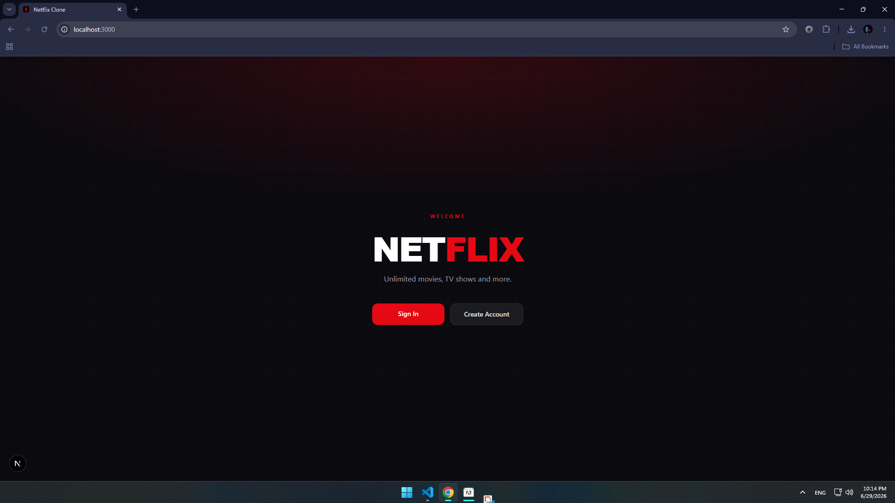
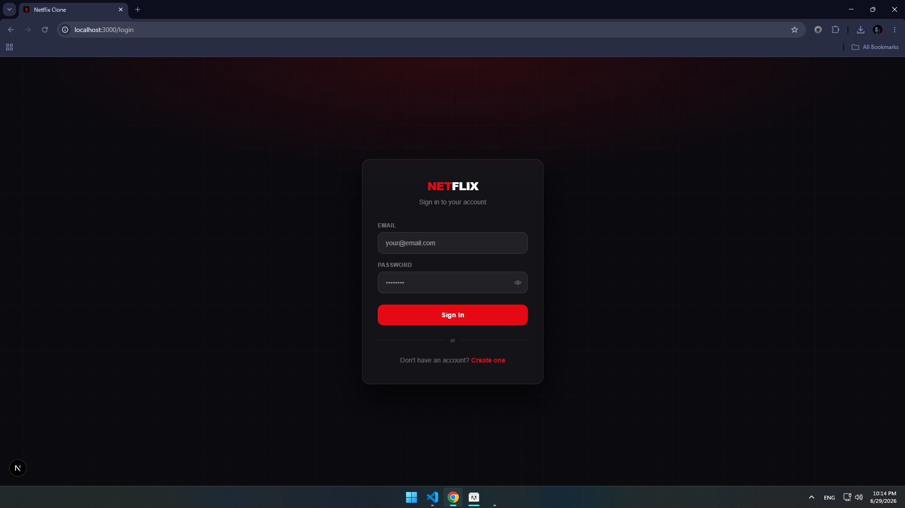
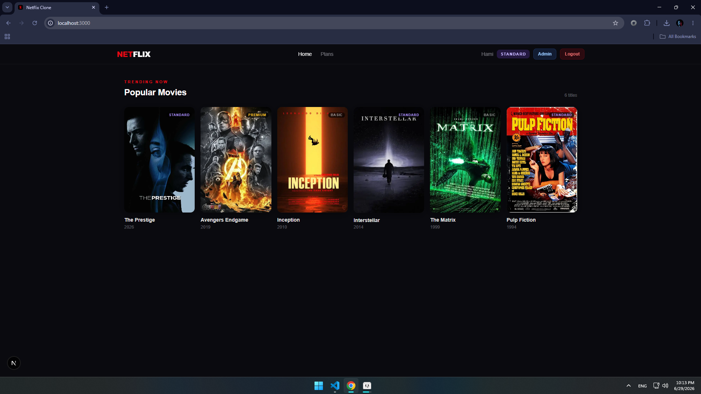
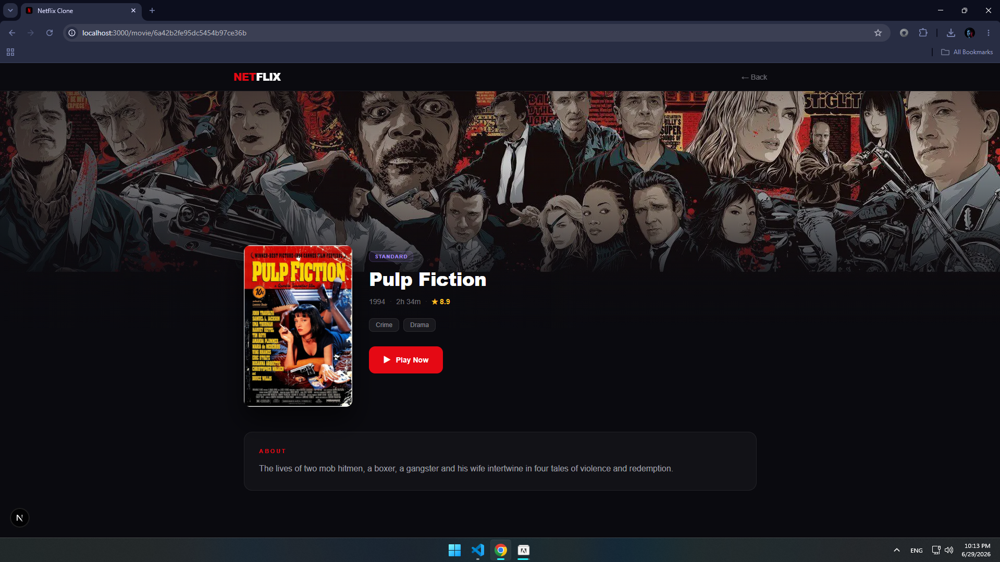
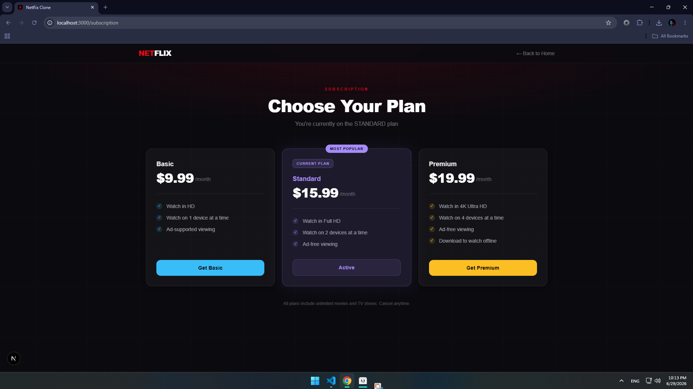
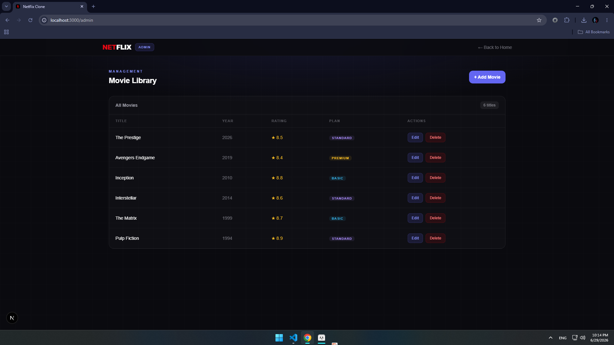

<div align="center">
  
  <h1>🎬 Netflix Clone</h1>
  <p><b>Stream movies. Experience cinema.</b> — A full-stack movie streaming platform built from scratch.</p>
  
  
  
  
  
  
</div>

## 🚀 About Netflix Clone
**Netflix Clone** is a production-ready, full-stack movie streaming platform with JWT authentication, subscription management (Basic $9.99, Standard $13.99, Premium $19.99), and a complete admin panel for movie management. Built with Next.js 15, TypeScript, Node.js Express, and MongoDB with a cinematic dark UI inspired by Netflix.

## ✨ Features
### 👤 User Side
- 🔐 JWT Authentication (Access + Refresh Tokens)
- 👤 User profiles with subscription status
- 🎬 Browse movies with search & filters
- 💳 3 subscription plans (Basic/Standard/Premium)
- 📱 Fully responsive design
### 🛠️ Admin Panel
- ➕ Add/Edit/Delete movies (title, description, genre, thumbnail, rating)
- 👥 View and manage all users
- 📊 Dashboard overview

## 🗄️ Database Schema
```
users     → email, hashed password, name, subscription plan, role (user/admin)
movies    → title, description, genre, thumbnail URL, rating, createdAt
subscriptions → user reference, plan type, status, start/end dates
```

## 🖼️ Project Preview
<div align="center">
  
  <br/><br/>
  
  <br/><br/>
  
  <br/><br/>
  
  <br/><br/>
  
  <br/><br/>
  
</div>

## 📁 Project Structure
```
netflix-clone/
├── frontend/
│   ├── app/              # Next.js 15 App Router
│   ├── components/       # UI components
│   ├── contexts/         # Auth context
│   ├── hooks/            # Custom hooks
│   └── utils/            # API client, validators
├── backend/
│   ├── models/           # User, Movie, Subscription schemas
│   ├── routes/           # Auth, user, movie, admin routes
│   ├── controllers/      # Business logic
│   ├── middleware/       # JWT auth, admin verification
│   └── config/           # Database, JWT config
└── README.md
```

## 💻 Key Code Snippets
### JWT Authentication Middleware
```typescript
export const authenticate = (req: Request, res: Response, next: NextFunction) => {
  const token = req.headers.authorization?.split(' ')[1];
  if (!token) return res.status(401).json({ message: 'Authentication required' });
  try {
    const decoded = jwt.verify(token, process.env.JWT_ACCESS_SECRET!);
    req.user = decoded;
    next();
  } catch {
    return res.status(403).json({ message: 'Invalid or expired token' });
  }
};
```
### User Model with Password Hashing
```typescript
const userSchema = new mongoose.Schema({
  email: { type: String, required: true, unique: true },
  password: { type: String, required: true },
  name: { type: String, required: true },
  subscription: {
    plan: { type: String, enum: ['basic', 'standard', 'premium'], default: 'basic' },
    status: { type: String, enum: ['active', 'inactive'], default: 'active' }
  },
  role: { type: String, enum: ['user', 'admin'], default: 'user' }
});
userSchema.pre('save', async function(next) {
  if (!this.isModified('password')) return next();
  this.password = await bcrypt.hash(this.password, 10);
  next();
});
```
### Login Controller
```typescript
export const login = async (req: Request, res: Response) => {
  const { email, password } = req.body;
  const user = await User.findOne({ email });
  if (!user || !(await user.comparePassword(password))) {
    return res.status(401).json({ message: 'Invalid credentials' });
  }
  const accessToken = jwt.sign(
    { userId: user._id, email: user.email, role: user.role },
    process.env.JWT_ACCESS_SECRET!,
    { expiresIn: '15m' }
  );
  const refreshToken = jwt.sign(
    { userId: user._id },
    process.env.JWT_REFRESH_SECRET!,
    { expiresIn: '7d' }
  );
  res.json({ accessToken, refreshToken, user: { id: user._id, name: user.name, email: user.email, subscription: user.subscription } });
};
```
### Auth Context (Frontend)
```typescript
const AuthContext = createContext<AuthContextType | undefined>(undefined);
export const AuthProvider = ({ children }: { children: ReactNode }) => {
  const [user, setUser] = useState<User | null>(null);
  const login = async (email: string, password: string) => {
    const response = await api.post('/auth/login', { email, password });
    const { accessToken, refreshToken, user } = response.data;
    localStorage.setItem('accessToken', accessToken);
    localStorage.setItem('refreshToken', refreshToken);
    setUser(user);
  };
  const logout = () => {
    localStorage.removeItem('accessToken');
    localStorage.removeItem('refreshToken');
    setUser(null);
  };
  useEffect(() => {
    const token = localStorage.getItem('accessToken');
    if (token) {
      api.get('/user/profile').then(response => setUser(response.data)).catch(() => logout());
    }
  }, []);
  return <AuthContext.Provider value={{ user, login, logout }}>{children}</AuthContext.Provider>;
};
```
### Movie Listing Component
```typescript
export default function MovieList() {
  const [movies, setMovies] = useState<Movie[]>([]);
  const [loading, setLoading] = useState(true);
  useEffect(() => {
    const fetchMovies = async () => {
      try {
        const response = await api.get('/movies');
        setMovies(response.data);
      } catch (error) {
        console.error('Failed to fetch movies:', error);
      } finally {
        setLoading(false);
      }
    };
    fetchMovies();
  }, []);
  if (loading) return <div className="text-white">Loading movies...</div>;
  return (
    <div className="grid grid-cols-2 md:grid-cols-4 lg:grid-cols-5 gap-4 p-4">
      {movies.map((movie) => (
        <MovieCard key={movie._id} movie={movie} />
      ))}
    </div>
  );
}
```
### Subscription Plan Component
```typescript
export default function PlanCard({ plan }: { plan: Plan }) {
  const { user } = useAuth();
  const isActive = user?.subscription?.plan === plan.name;
  const handleSubscribe = async () => {
    try {
      await api.put('/user/subscription', { plan: plan.name });
      alert('Subscription updated successfully!');
    } catch (error) {
      alert('Failed to update subscription');
    }
  };
  return (
    <div className="bg-gray-800 rounded-lg p-6 text-white border border-gray-700 hover:border-red-600 transition">
      <h3 className="text-2xl font-bold capitalize">{plan.name}</h3>
      <p className="text-3xl font-bold mt-2">{plan.price}<span className="text-sm font-normal text-gray-400">/month</span></p>
      <ul className="mt-4 space-y-2">
        {plan.features.map((feature, index) => (
          <li key={index} className="flex items-center">
            <span className="text-green-500 mr-2">✓</span> {feature}
          </li>
        ))}
      </ul>
      <button
        onClick={handleSubscribe}
        disabled={isActive}
        className={`w-full mt-6 py-2 rounded font-semibold transition ${
          isActive ? 'bg-gray-600 cursor-not-allowed' : 'bg-red-600 hover:bg-red-700'
        }`}
      >
        {isActive ? 'Current Plan' : 'Subscribe'}
      </button>
    </div>
  );
}
```

## ⚙️ Installation & Setup
```bash
# 1. Clone
git clone https://github.com/HamiParsa/netflix-clone.git
cd netflix-clone

# 2. Backend setup
cd backend
npm install
# Create .env with: PORT, MONGODB_URI, JWT_ACCESS_SECRET, JWT_REFRESH_SECRET
npm run dev  # http://localhost:5000

# 3. Frontend setup
cd ../frontend
npm install
# Create .env.local with: NEXT_PUBLIC_API_URL=http://localhost:5000/api
npm run dev  # http://localhost:3000
```

## 📡 API Endpoints
| Method | Endpoint | Description | Auth |
|--------|----------|-------------|------|
| POST | `/api/auth/register` | Register new user | Public |
| POST | `/api/auth/login` | Login with JWT | Public |
| POST | `/api/auth/refresh` | Refresh token | Public |
| GET | `/api/user/profile` | Get profile | Private |
| PUT | `/api/user/subscription` | Update plan | Private |
| GET | `/api/movies` | Get all movies | Private |
| POST | `/api/movies` | Add movie | Admin |
| PUT | `/api/movies/:id` | Update movie | Admin |
| DELETE | `/api/movies/:id` | Delete movie | Admin |
| GET | `/api/admin/users` | Get all users | Admin |

## 🚀 Deployment
**Backend (Render/Railway):**
```bash
npm run build && npm start
```
**Frontend (Vercel):**
```bash
npm run build && vercel --prod
```

## 👨‍💻 Author
**Developed by:** [HamiParsa](https://github.com/HamiParsa)
💬 Full-Stack Developer | Building real-world projects with modern web technologies

<div align="center">
  
  <br/><br/>
  <i>Built with ❤️ and a lot of ☕</i>
</div>
